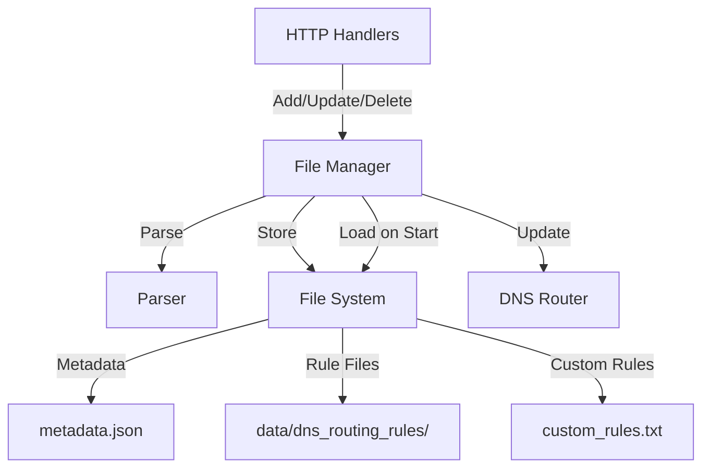

# Design Document

## Overview

The DNS Routing File Manager is a centralized module that manages all DNS routing rule file operations. Currently, rule file handling is scattered across multiple components (internal/home/dns_routing.go, internal/filtering/filter.go, internal/dnsrouting/parser.go), leading to inconsistent behavior, difficult maintenance, and integration issues such as:

- Custom rules not being reloaded when domain list rules are disabled
- Rule file parsing happening in multiple places with different logic
- Inconsistent persistence mechanisms
- Difficulty tracking rule file state across restarts

This module will provide a single, unified interface for all DNS routing rule file operations, improving code quality and preventing bugs related to rule file handling.

## Architecture

The File Manager will be implemented as a new package `internal/dnsroutingfiles` with the following components:

```
internal/dnsroutingfiles/
├── manager.go          # Main file manager implementation
├── metadata.go         # Rule metadata structures and persistence
├── storage.go          # File system operations
└── manager_test.go     # Unit tests
```

The File Manager will integrate with existing components:

1. **DNS Router** (`internal/dnsrouting/router.go`): Receives parsed rules from File Manager
2. **Parser** (`internal/dnsrouting/parser.go`): Used by File Manager to parse rule files
3. **HTTP Handlers** (`internal/home/dns_routing.go`): Call File Manager methods instead of direct file operations
4. **Filtering System** (`internal/filtering/filter.go`): File Manager replaces DNS routing file handling in filtering



## Components and Interfaces

### 1. File Manager Interface

```go
// Manager handles all DNS routing rule file operations.
type Manager interface {
    // AddDomainListRule adds a new domain list rule from a URL.
    // It downloads, parses, and persists the rule file.
    AddDomainListRule(ctx context.Context, rule *DomainListRule) error
    
    // UpdateDomainListRule updates an existing domain list rule.
    // It re-downloads and re-parses the rule file if the URL changed.
    UpdateDomainListRule(ctx context.Context, rule *DomainListRule) error
    
    // DeleteDomainListRule deletes a domain list rule and its file.
    DeleteDomainListRule(ctx context.Context, ruleID int64) error
    
    // RefreshDomainListRule re-downloads and re-parses a rule file.
    RefreshDomainListRule(ctx context.Context, ruleID int64) error
    
    // GetDomainListRule returns a domain list rule by ID.
    GetDomainListRule(ruleID int64) (*DomainListRule, error)
    
    // GetAllDomainListRules returns all domain list rules.
    GetAllDomainListRules() []*DomainListRule
    
    // AddCustomRule adds a new custom domain rule.
    AddCustomRule(ctx context.Context, rule *CustomRule) error
    
    // UpdateCustomRule updates an existing custom domain rule.
    UpdateCustomRule(ctx context.Context, oldDomain, oldMatchType string, rule *CustomRule) error
    
    // DeleteCustomRule deletes a custom domain rule.
    DeleteCustomRule(ctx context.Context, domain, matchType string) error
    
    // GetAllCustomRules returns all custom domain rules.
    GetAllCustomRules() []*CustomRule
    
    // LoadAll loads all persisted rules from disk on startup.
    LoadAll(ctx context.Context) error
    
    // Close closes the file manager and releases resources.
    Close() error
}
```

### 2. Rule Structures

```go
// DomainListRule represents a DNS routing rule from a URL source.
type DomainListRule struct {
    ID             int64
    Name           string
    URL            string
    UpstreamGroup  string
    Priority       int
    Enabled        bool
    RulesCount     int
    LastUpdated    time.Time
    FilePath       string  // Path to the downloaded rule file
}

// CustomRule represents a user-defined DNS routing rule.
type CustomRule struct {
    Domain        string
    MatchType     string  // DOMAIN, DOMAIN-SUFFIX, DOMAIN-KEYWORD
    UpstreamGroup string
    Enabled       bool
}
```

### 3. Metadata Persistence

```go
// Metadata contains all persisted rule information.
type Metadata struct {
    DomainListRules []*DomainListRule `json:"domain_list_rules"`
    CustomRules     []*CustomRule     `json:"custom_rules"`
    Version         int               `json:"version"`  // For future migrations
}
```

Metadata will be stored in `data/dns_routing_rules/metadata.json`.

### 4. Storage Layout

```
data/
└── dns_routing_rules/
    ├── metadata.json           # Rule metadata
    ├── custom_rules.txt        # Custom domain rules
    ├── 1.txt                   # Domain list rule file (ID=1)
    ├── 2.txt                   # Domain list rule file (ID=2)
    └── ...
```

## Data Models

### DomainListRule

- **ID**: Unique identifier (int64)
- **Name**: Human-readable name
- **URL**: Source URL for the rule file
- **UpstreamGroup**: Target upstream group ID
- **Priority**: Rule priority (lower = higher priority)
- **Enabled**: Whether the rule is active
- **RulesCount**: Number of parsed rules
- **LastUpdated**: Last update timestamp
- **FilePath**: Path to the downloaded rule file

### CustomRule

- **Domain**: Domain pattern to match
- **MatchType**: Type of matching (DOMAIN, DOMAIN-SUFFIX, DOMAIN-KEYWORD)
- **UpstreamGroup**: Target upstream group ID
- **Enabled**: Whether the rule is active

### Metadata

- **DomainListRules**: Array of domain list rules
- **CustomRules**: Array of custom rules
- **Version**: Metadata format version for future migrations

## Correctness Properties

*A property is a characteristic or behavior that should hold true across all valid executions of a system-essentially, a formal statement about what the system should do. Properties serve as the bridge between human-readable specifications and machine-verifiable correctness guarantees.*


### Property Reflection

After reviewing all testable properties from the prework analysis, several redundancies were identified:

- Properties 1.1, 1.2, 1.3 can be combined into a single property about centralized file operations
- Properties 1.4 and 3.3 are identical (startup loading)
- Properties 2.1, 2.2, 2.3, 2.4 can be combined into a single property about API completeness
- Properties 3.1 and 3.2 can be combined into a property about file storage conventions
- Properties 5.1 and 5.2 can be combined into a property about router integration
- Properties 8.1, 8.2, 8.3, 8.4 can be combined into a property about comprehensive logging
- Properties 10.1, 10.3 can be combined into a property about metadata persistence

The following properties provide unique validation value and will be included:

Property 1: File operations are centralized (combines 1.1, 1.2, 1.3)
Property 2: Startup loading (1.4/3.3)
Property 3: Modification persistence (1.5)
Property 4: API completeness (combines 2.1-2.4)
Property 5: File storage conventions (combines 3.1, 3.2)
Property 6: File cleanup on deletion (3.4)
Property 7: Directory initialization (3.5)
Property 8: Custom rules round-trip (4.3)
Property 9: Atomic writes (4.5)
Property 10: Router integration (combines 5.1, 5.2)
Property 11: Batch router updates (5.3)
Property 12: Thread safety (6.1)
Property 13: Concurrent write prevention (6.2)
Property 14: Concurrent read support (6.3)
Property 15: Download functionality (9.1)
Property 16: Download error handling (9.2)
Property 17: Refresh re-downloads (9.4)
Property 18: Protocol support (9.5)
Property 19: Metadata persistence (combines 10.1, 10.3)
Property 20: Metadata loading (10.2)
Property 21: Timestamp updates (10.4)

### Correctness Properties

Property 1: Centralized file operations
*For any* DNS routing rule file operation (save, load, parse), the File Manager should be the single component handling the operation, ensuring consistent behavior across the application.
**Validates: Requirements 1.1, 1.2, 1.3**

Property 2: Startup loading completeness
*For any* set of persisted rule files and metadata, when the File Manager initializes, all rules should be loaded and available for routing.
**Validates: Requirements 1.4, 3.3**

Property 3: Modification persistence
*For any* rule modification (add, update, delete), the changes should be immediately persisted to disk, ensuring no data loss on restart.
**Validates: Requirements 1.5**

Property 4: API operation completeness
*For any* rule operation (add, update, delete, refresh), calling the corresponding File Manager method should complete all necessary sub-operations (download, parse, persist, notify) without requiring additional calls.
**Validates: Requirements 2.1, 2.2, 2.3, 2.4**

Property 5: File storage conventions
*For any* domain list rule, the rule file should be stored in the dedicated directory with a filename matching the pattern {ID}.txt.
**Validates: Requirements 3.1, 3.2**

Property 6: File cleanup on deletion
*For any* rule deletion, the corresponding rule file should be removed from disk, leaving no orphaned files.
**Validates: Requirements 3.4**

Property 7: Directory initialization
*For any* File Manager initialization, if the rule directory does not exist, it should be created automatically.
**Validates: Requirements 3.5**

Property 8: Custom rules round-trip
*For any* set of custom rules, saving them to disk and then loading them back should preserve all rule properties (domain, match type, upstream group, enabled state).
**Validates: Requirements 4.3**

Property 9: Atomic write safety
*For any* file write operation, the file should either be completely written or not written at all, preventing partial writes that could corrupt data.
**Validates: Requirements 4.5**

Property 10: Router integration
*For any* rule operation that changes routing behavior (add, update, delete, load), the DNS router should be updated with the new rules.
**Validates: Requirements 5.1, 5.2**

Property 11: Batch router updates
*For any* sequence of rule operations performed in quick succession, the router should be notified at most once after all operations complete, avoiding unnecessary reloads.
**Validates: Requirements 5.3**

Property 12: Thread-safe operations
*For any* concurrent access to the File Manager from multiple goroutines, all operations should complete successfully without race conditions or data corruption.
**Validates: Requirements 6.1**

Property 13: Concurrent write prevention
*For any* two concurrent write operations to the same rule file, only one should proceed at a time, preventing file corruption.
**Validates: Requirements 6.2**

Property 14: Concurrent read support
*For any* number of concurrent read operations, all should succeed simultaneously without blocking each other.
**Validates: Requirements 6.3**

Property 15: Download functionality
*For any* domain list rule with a valid URL, adding the rule should result in the rule file being downloaded from the URL and saved to disk.
**Validates: Requirements 9.1**

Property 16: Download error handling
*For any* download operation that fails (timeout, network error, invalid response), the File Manager should return a clear error and not create a partial or corrupted file.
**Validates: Requirements 9.2**

Property 17: Refresh re-downloads
*For any* rule refresh operation, the rule file should be re-downloaded from its URL, replacing the existing file.
**Validates: Requirements 9.4**

Property 18: Protocol support
*For any* rule URL using HTTP or HTTPS protocol, the File Manager should successfully download the rule file.
**Validates: Requirements 9.5**

Property 19: Metadata persistence
*For any* rule operation that modifies metadata (add, update), all metadata fields (ID, name, URL, upstream group, priority, enabled state) should be persisted to the metadata file.
**Validates: Requirements 10.1, 10.3**

Property 20: Metadata loading
*For any* File Manager restart, all rule metadata should be loaded from the metadata file and match what was persisted.
**Validates: Requirements 10.2**

Property 21: Timestamp updates
*For any* rule refresh operation, the last_updated timestamp in the metadata should be updated to reflect the refresh time.
**Validates: Requirements 10.4**

## Error Handling

The File Manager will implement comprehensive error handling:

1. **File System Errors**
   - Directory creation failures: Log error and return to caller
   - File read/write failures: Log error with file path and return to caller
   - Permission errors: Log error with details and return to caller

2. **Network Errors**
   - Download timeouts: Return error with timeout duration
   - Connection failures: Return error with URL and reason
   - Invalid HTTP status: Return error with status code

3. **Parsing Errors**
   - Unknown format: Return error indicating format detection failed
   - Invalid rule syntax: Log warning and skip invalid rules
   - Empty file: Return error indicating no valid rules found

4. **Concurrency Errors**
   - Lock acquisition failures: Retry with exponential backoff
   - Deadlock detection: Log error and panic (should never happen)

5. **Validation Errors**
   - Invalid rule ID: Return error indicating rule not found
   - Duplicate rule: Return error indicating rule already exists
   - Invalid URL: Return error indicating URL validation failed

All errors will be logged with structured logging including:
- Operation being performed
- Rule ID (if applicable)
- File path (if applicable)
- Error message and stack trace

## Testing Strategy

### Unit Testing

Unit tests will cover:
- Individual File Manager methods (add, update, delete, refresh)
- Metadata serialization/deserialization
- File path generation
- Error handling for various failure scenarios
- Concurrent access patterns

### Property-Based Testing

Property-based tests will verify the correctness properties defined above. We will use the `testing/quick` package from Go's standard library for property-based testing.

Each property-based test will:
- Generate random rule data (IDs, names, URLs, etc.)
- Perform operations on the File Manager
- Verify the property holds across all generated inputs
- Run a minimum of 100 iterations per test

Property-based tests will be tagged with comments explicitly referencing the correctness property they implement, using the format:
`// **Feature: dns-routing-file-manager, Property {number}: {property_text}**`

### Integration Testing

Integration tests will verify:
- File Manager integration with DNS Router
- File Manager integration with HTTP handlers
- End-to-end rule lifecycle (add → update → refresh → delete)
- Restart behavior (persist → restart → load)

### Test Organization

```
internal/dnsroutingfiles/
├── manager_test.go           # Unit tests and property-based tests
├── metadata_test.go          # Metadata serialization tests
├── storage_test.go           # File system operation tests
└── integration_test.go       # Integration tests
```

## Implementation Notes

### Thread Safety

The File Manager will use a `sync.RWMutex` to protect shared state:
- Write lock for: add, update, delete, refresh operations
- Read lock for: get, list operations

### Atomic Writes

File writes will use the `aghrenameio.PendingFile` pattern (already used in AdGuard Home):
1. Write to temporary file
2. Sync to disk
3. Rename to final location (atomic operation)

### Router Integration

The File Manager will accept a callback function for router updates:

```go
type RouterUpdateCallback func(ctx context.Context) error

type Config struct {
    DataDir string
    Logger  *slog.Logger
    HTTPClient *http.Client
    OnRouterUpdate RouterUpdateCallback
}
```

### Batch Updates

The File Manager will implement a simple debouncing mechanism:
- Queue router update requests
- Use a timer to batch updates within a 100ms window
- Call router update callback once after the window expires

### Migration from Current Implementation

Migration will happen in phases:

1. **Phase 1**: Implement File Manager alongside existing code
2. **Phase 2**: Update HTTP handlers to use File Manager
3. **Phase 3**: Remove DNS routing file handling from filtering system
4. **Phase 4**: Clean up old code and migrate existing rule files

During migration, the File Manager will:
- Detect existing rule files in `data/filters/` directory
- Copy them to `data/dns_routing_rules/` directory
- Generate metadata from existing configuration
- Preserve all rule IDs and settings
