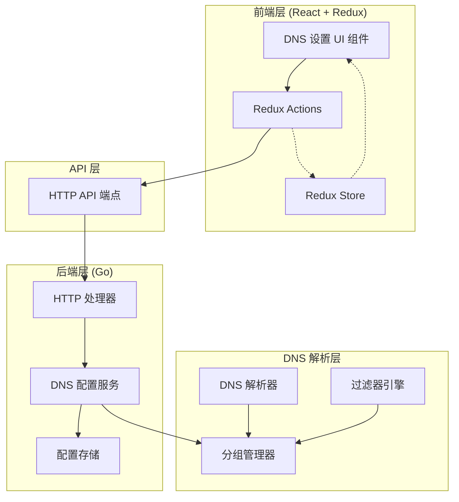

# 设计文档

## 概述

本设计文档描述了为 AdGuard Home 添加 DNS 上游服务器分组管理功能的技术实现方案。该功能允许用户创建多个独立的 DNS 上游分组，每个分组包含不同的 DNS 服务器列表，并可以设置默认分组。分组可以被过滤器规则调用，实现更灵活的 DNS 解析策略。

该功能将完全遵循 AdGuard Home 现有的 UI 设计风格和代码架构模式，确保与现有系统的无缝集成。

## 架构

### 整体架构



### 数据流

1. **创建/编辑分组流程**:
   - 用户在 UI 中填写分组信息
   - 前端通过 Redux Action 调用 API
   - 后端验证数据并保存到配置文件
   - 返回成功响应，前端更新 Redux Store
   - UI 自动刷新显示最新数据

2. **DNS 查询流程**:
   - DNS 查询进入解析器
   - 过滤器引擎检查是否有匹配的规则
   - 如果有规则指定分组，使用该分组的上游服务器
   - 如果没有匹配规则，使用默认分组的上游服务器
   - 返回解析结果

## 组件和接口

### 前端组件

#### 1. UpstreamGroups 组件 (新增)

**位置**: `client/src/components/Settings/Dns/UpstreamGroups/`

**职责**: 管理 DNS 上游分组的主容器组件

**子组件**:
- `index.tsx`: 主组件，负责数据获取和状态管理
- `GroupList.tsx`: 分组列表展示组件
- `GroupModal.tsx`: 分组创建/编辑对话框
- `GroupRow.tsx`: 单个分组行组件

**接口**:
```typescript
interface UpstreamGroup {
  id: string;                    // 分组唯一标识符
  name: string;                  // 分组名称
  enabled: boolean;              // 是否启用
  is_default: boolean;           // 是否为默认分组
  upstream_dns: string[];        // 上游 DNS 服务器列表
  bootstrap_dns?: string[];      // Bootstrap DNS 服务器列表（可选）
  created_at: string;            // 创建时间
  updated_at: string;            // 更新时间
}

interface UpstreamGroupsState {
  groups: UpstreamGroup[];       // 分组列表
  processing: boolean;           // 是否正在加载
  processingAdd: boolean;        // 是否正在添加
  processingUpdate: boolean;     // 是否正在更新
  processingDelete: boolean;     // 是否正在删除
  processingTest: boolean;       // 是否正在测试
  isModalOpen: boolean;          // 对话框是否打开
  modalType: 'add' | 'edit';     // 对话框类型
  currentGroup?: UpstreamGroup;  // 当前编辑的分组
}
```

#### 2. Redux Actions (新增)

**位置**: `client/src/actions/upstreamGroups.ts`

**Actions**:
```typescript
// 获取分组列表
getUpstreamGroupsRequest()
getUpstreamGroupsSuccess(groups: UpstreamGroup[])
getUpstreamGroupsFailure()

// 添加分组
addUpstreamGroupRequest()
addUpstreamGroupSuccess(group: UpstreamGroup)
addUpstreamGroupFailure()

// 更新分组
updateUpstreamGroupRequest()
updateUpstreamGroupSuccess(group: UpstreamGroup)
updateUpstreamGroupFailure()

// 删除分组
deleteUpstreamGroupRequest()
deleteUpstreamGroupSuccess(id: string)
deleteUpstreamGroupFailure()

// 设置默认分组
setDefaultGroupRequest()
setDefaultGroupSuccess(id: string)
setDefaultGroupFailure()

// 测试分组连通性
testUpstreamGroupRequest()
testUpstreamGroupSuccess(result: TestResult)
testUpstreamGroupFailure()
```

#### 3. Redux Reducer (新增)

**位置**: `client/src/reducers/upstreamGroups.ts`

**初始状态**:
```typescript
const initialState: UpstreamGroupsState = {
  groups: [],
  processing: false,
  processingAdd: false,
  processingUpdate: false,
  processingDelete: false,
  processingTest: false,
  isModalOpen: false,
  modalType: 'add',
  currentGroup: undefined,
};
```

#### 4. API 客户端方法 (新增)

**位置**: `client/src/api/Api.ts`

**方法**:
```typescript
class Api {
  // 获取所有分组
  getUpstreamGroups(): Promise<UpstreamGroup[]>
  
  // 添加分组
  addUpstreamGroup(group: Partial<UpstreamGroup>): Promise<UpstreamGroup>
  
  // 更新分组
  updateUpstreamGroup(id: string, group: Partial<UpstreamGroup>): Promise<UpstreamGroup>
  
  // 删除分组
  deleteUpstreamGroup(id: string): Promise<void>
  
  // 设置默认分组
  setDefaultUpstreamGroup(id: string): Promise<void>
  
  // 测试分组连通性
  testUpstreamGroup(id: string): Promise<TestResult>
}
```

### 后端组件

#### 1. HTTP API 端点 (新增)

**位置**: `internal/home/` 或 `internal/dnsforward/`

**端点**:
```
GET    /control/dns/upstream_groups          - 获取所有分组
POST   /control/dns/upstream_groups          - 创建新分组
PUT    /control/dns/upstream_groups/:id      - 更新分组
DELETE /control/dns/upstream_groups/:id      - 删除分组
POST   /control/dns/upstream_groups/:id/test - 测试分组连通性
POST   /control/dns/upstream_groups/:id/default - 设置为默认分组
```

**请求/响应格式**:
```go
// 分组结构
type UpstreamGroup struct {
    ID           string    `yaml:"id" json:"id"`
    Name         string    `yaml:"name" json:"name"`
    Enabled      bool      `yaml:"enabled" json:"enabled"`
    IsDefault    bool      `yaml:"is_default" json:"is_default"`
    UpstreamDNS  []string  `yaml:"upstream_dns" json:"upstream_dns"`
    BootstrapDNS []string  `yaml:"bootstrap_dns,omitempty" json:"bootstrap_dns,omitempty"`
    CreatedAt    time.Time `yaml:"created_at" json:"created_at"`
    UpdatedAt    time.Time `yaml:"updated_at" json:"updated_at"`
}

// 创建/更新请求
type UpstreamGroupRequest struct {
    Name         string   `json:"name"`
    Enabled      bool     `json:"enabled"`
    IsDefault    bool     `json:"is_default"`
    UpstreamDNS  []string `json:"upstream_dns"`
    BootstrapDNS []string `json:"bootstrap_dns,omitempty"`
}

// 测试结果
type TestResult struct {
    GroupID string              `json:"group_id"`
    Results []UpstreamTestResult `json:"results"`
}

type UpstreamTestResult struct {
    Upstream string `json:"upstream"`
    Success  bool   `json:"success"`
    Error    string `json:"error,omitempty"`
    RTT      int64  `json:"rtt,omitempty"` // 响应时间（毫秒）
}
```

#### 2. 配置管理服务 (修改)

**位置**: `internal/home/config.go`

**修改内容**:
在现有的配置结构中添加分组配置：

```go
type configuration struct {
    // ... 现有字段 ...
    
    DNS struct {
        // ... 现有字段 ...
        
        // 新增：上游分组配置
        UpstreamGroups []UpstreamGroup `yaml:"upstream_groups"`
    } `yaml:"dns"`
}
```

#### 3. 分组管理器 (新增)

**位置**: `internal/dnsforward/upstream_groups.go`

**职责**: 管理 DNS 上游分组的生命周期和查询

**接口**:
```go
type UpstreamGroupManager interface {
    // 获取所有分组
    GetGroups() []UpstreamGroup
    
    // 根据 ID 获取分组
    GetGroup(id string) (*UpstreamGroup, error)
    
    // 获取默认分组
    GetDefaultGroup() (*UpstreamGroup, error)
    
    // 添加分组
    AddGroup(group *UpstreamGroup) error
    
    // 更新分组
    UpdateGroup(id string, group *UpstreamGroup) error
    
    // 删除分组
    DeleteGroup(id string) error
    
    // 设置默认分组
    SetDefaultGroup(id string) error
    
    // 根据分组 ID 获取上游服务器
    GetUpstreams(groupID string) ([]upstream.Upstream, error)
    
    // 测试分组连通性
    TestGroup(groupID string) (*TestResult, error)
}
```

#### 4. DNS 解析器集成 (修改)

**位置**: `internal/dnsforward/dnsforward.go`

**修改内容**:
在 DNS 解析流程中集成分组管理器，支持根据过滤器规则选择不同的上游分组。

```go
type Server struct {
    // ... 现有字段 ...
    
    // 新增：分组管理器
    upstreamGroupManager UpstreamGroupManager
}

// 修改解析方法，支持分组选择
func (s *Server) resolve(req *dns.Msg, clientIP net.IP) (*dns.Msg, error) {
    // 1. 检查过滤器规则，获取指定的分组 ID
    groupID := s.getGroupIDFromFilter(req.Question[0].Name)
    
    // 2. 如果没有指定分组，使用默认分组
    if groupID == "" {
        defaultGroup, err := s.upstreamGroupManager.GetDefaultGroup()
        if err != nil {
            return nil, err
        }
        groupID = defaultGroup.ID
    }
    
    // 3. 获取分组的上游服务器
    upstreams, err := s.upstreamGroupManager.GetUpstreams(groupID)
    if err != nil {
        return nil, err
    }
    
    // 4. 使用上游服务器进行解析
    return s.exchange(req, upstreams)
}
```

## 数据模型

### 前端数据模型

```typescript
// 分组模型
interface UpstreamGroup {
  id: string;                    // UUID 格式的唯一标识符
  name: string;                  // 分组名称，1-50 个字符
  enabled: boolean;              // 是否启用，默认 true
  is_default: boolean;           // 是否为默认分组，系统中只能有一个
  upstream_dns: string[];        // 上游 DNS 服务器列表，至少一个
  bootstrap_dns?: string[];      // Bootstrap DNS 服务器列表，可选
  created_at: string;            // ISO 8601 格式的创建时间
  updated_at: string;            // ISO 8601 格式的更新时间
}

// 测试结果模型
interface TestResult {
  group_id: string;
  results: UpstreamTestResult[];
}

interface UpstreamTestResult {
  upstream: string;              // 上游服务器地址
  success: boolean;              // 是否测试成功
  error?: string;                // 错误信息（如果失败）
  rtt?: number;                  // 响应时间（毫秒）
}

// Redux State 模型
interface UpstreamGroupsState {
  groups: UpstreamGroup[];
  processing: boolean;
  processingAdd: boolean;
  processingUpdate: boolean;
  processingDelete: boolean;
  processingTest: boolean;
  isModalOpen: boolean;
  modalType: 'add' | 'edit';
  currentGroup?: UpstreamGroup;
}
```

### 后端数据模型

```go
// 分组结构
type UpstreamGroup struct {
    ID           string    `yaml:"id" json:"id"`
    Name         string    `yaml:"name" json:"name"`
    Enabled      bool      `yaml:"enabled" json:"enabled"`
    IsDefault    bool      `yaml:"is_default" json:"is_default"`
    UpstreamDNS  []string  `yaml:"upstream_dns" json:"upstream_dns"`
    BootstrapDNS []string  `yaml:"bootstrap_dns,omitempty" json:"bootstrap_dns,omitempty"`
    CreatedAt    time.Time `yaml:"created_at" json:"created_at"`
    UpdatedAt    time.Time `yaml:"updated_at" json:"updated_at"`
}

// 配置文件结构（YAML）
type DNSConfig struct {
    // ... 现有字段 ...
    UpstreamGroups []UpstreamGroup `yaml:"upstream_groups"`
}
```

**注意**: 
- YAML标签在前，JSON标签在后（与AdGuard Home代码风格保持一致）
- 使用标准YAML标签，`[]string` 类型会自动序列化为块格式
- `omitempty` 标签确保空数组不会出现在配置文件中
```

### 配置文件格式

```yaml
dns:
  # ... 现有配置 ...
  
  # 上游分组配置
  upstream_groups:
    - id: 550e8400-e29b-41d4-a716-446655440000
      name: 国内
      enabled: true
      is_default: true
      upstream_dns:
        - 223.6.6.6
        - 119.29.29.29
      bootstrap_dns:
        - 223.5.5.5
      created_at: 2024-01-01T00:00:00Z
      updated_at: 2024-01-01T00:00:00Z
    
    - id: 550e8400-e29b-41d4-a716-446655440001
      name: 海外
      enabled: true
      is_default: false
      upstream_dns:
        - https://dns.google/dns-query
        - https://cloudflare-dns.com/dns-query
      bootstrap_dns:
        - 8.8.8.8
        - 1.1.1.1
      created_at: 2024-01-01T00:00:00Z
      updated_at: 2024-01-01T00:00:00Z
```

**重要说明**:
- YAML格式使用块格式（每行一个条目），与AdGuard Home现有的 `bootstrap_dns` 配置格式保持一致
- 字符串值不需要引号（除非包含特殊字符）
- 数组使用 `-` 开头的列表格式，而不是 `[item1, item2]` 格式

### 数据验证规则

**前端验证**:
- 分组名称：必填，1-50 个字符，不能包含特殊字符
- 上游 DNS 列表：至少包含一个有效的 DNS 服务器地址
- DNS 服务器格式：支持 IP、域名、DoH、DoT、DoQ 等格式

**后端验证**:
- 分组 ID：UUID 格式
- 分组名称：唯一性检查
- 默认分组：确保系统中只有一个默认分组
- DNS 服务器地址：格式验证和连通性检查（可选）

## 正确性属性

*属性是一个特征或行为，应该在系统的所有有效执行中保持为真——本质上是关于系统应该做什么的正式陈述。属性作为人类可读规范和机器可验证正确性保证之间的桥梁。*

### 属性 1: 创建分组后列表包含该分组

*对于任意*有效的分组名称和上游服务器列表，创建分组后，分组列表中应该包含该分组，且分组信息完整。

**验证需求**: 1.2, 1.5

### 属性 2: 编辑分组预填充当前配置

*对于任意*分组，点击编辑按钮后，编辑对话框应该显示该分组的当前配置信息（名称、上游服务器列表、启用状态等）。

**验证需求**: 2.1

### 属性 3: 更新分组反映新配置

*对于任意*有效的分组修改，保存后分组列表应该显示更新后的配置信息。

**验证需求**: 2.2, 2.5

### 属性 4: 删除非默认分组从列表移除

*对于任意*非默认分组，确认删除后该分组应该从分组列表中消失。

**验证需求**: 3.2

### 属性 5: 设置默认分组标记正确

*对于任意*分组，设置为默认分组后该分组应该显示默认标识。

**验证需求**: 4.1

### 属性 6: 默认分组唯一性

*对于任意*系统状态，设置新的默认分组时，之前的默认分组应该失去默认状态，确保系统中始终只有一个默认分组。

**验证需求**: 4.2, 4.4

### 属性 7: 无匹配规则使用默认分组

*对于任意*没有匹配过滤器规则的 DNS 查询，系统应该使用默认分组的上游服务器进行解析。

**验证需求**: 4.5

### 属性 8: 启用分组状态正确

*对于任意*分组，勾选"已启用"复选框后该分组的 enabled 状态应该为 true。

**验证需求**: 5.1

### 属性 9: 禁用分组状态正确

*对于任意*分组，取消勾选"已启用"复选框后该分组的 enabled 状态应该为 false。

**验证需求**: 5.2

### 属性 10: 禁用分组不用于解析

*对于任意*被禁用的分组，即使被过滤器规则指定，也不应该使用该分组的上游服务器进行 DNS 解析。

**验证需求**: 5.3

### 属性 11: 测试分组检测所有服务器

*对于任意*分组，点击检测按钮后应该测试该分组中的所有上游服务器，并返回每个服务器的测试结果。

**验证需求**: 6.1

### 属性 12: 测试结果包含完整信息

*对于任意*分组测试，测试结果应该包含每个上游服务器的响应时间或错误信息。

**验证需求**: 6.3

### 属性 13: 测试失败显示错误信息

*对于任意*包含失败服务器的测试结果，应该显示失败的服务器地址和具体错误原因。

**验证需求**: 6.5

### 属性 14: 分组列表显示完整信息

*对于任意*分组，在分组列表中应该显示已启用状态、分组名称、上游服务器地址和操作按钮。

**验证需求**: 7.2

### 属性 15: 分页支持多分组

*对于任意*超过页面大小的分组列表，应该支持分页显示。

**验证需求**: 7.5

### 属性 16: API 根据名称获取分组

*对于任意*有效的分组名称，API 应该能够返回该分组的完整配置信息。

**验证需求**: 8.2

### 属性 17: 配置持久化保存

*对于任意*创建或修改分组的操作，配置应该被保存到持久化存储中。

**验证需求**: 10.1

### 属性 18: 保存失败回滚状态

*对于任意*配置保存失败的情况，系统应该显示错误提示并保持当前配置不变（回滚）。

**验证需求**: 10.3


## 错误处理

### 前端错误处理

#### 1. 表单验证错误

**场景**: 用户输入无效数据
- 分组名称为空或超过长度限制
- 上游服务器列表为空
- DNS 服务器地址格式无效

**处理方式**:
- 在表单字段下方显示红色错误提示文本
- 禁用保存按钮直到错误修复
- 使用 React Hook Form 的内置验证机制

**示例**:
```typescript
{
  name: {
    required: '分组名称不能为空',
    maxLength: { value: 50, message: '分组名称不能超过50个字符' }
  },
  upstream_dns: {
    required: '至少需要一个上游DNS服务器',
    validate: (value) => validateDnsServers(value) || 'DNS服务器地址格式无效'
  }
}
```

#### 2. API 请求错误

**场景**: API 调用失败
- 网络连接错误
- 服务器返回 4xx/5xx 错误
- 请求超时

**处理方式**:
- 使用 Redux Toast 显示错误通知
- 在控制台记录详细错误信息
- 恢复 UI 到可操作状态（取消加载状态）

**示例**:
```typescript
try {
  await apiClient.addUpstreamGroup(group);
  dispatch(addSuccessToast('分组创建成功'));
} catch (error) {
  dispatch(addErrorToast({ 
    error,
    message: '创建分组失败，请稍后重试'
  }));
  dispatch(addUpstreamGroupFailure());
}
```

#### 3. 业务逻辑错误

**场景**: 违反业务规则
- 尝试删除默认分组
- 分组名称重复
- 尝试禁用所有分组

**处理方式**:
- 显示模态对话框说明错误原因
- 提供解决建议
- 阻止操作继续执行

### 后端错误处理

#### 1. 请求验证错误

**HTTP 状态码**: 400 Bad Request

**场景**:
- 请求体格式错误
- 必填字段缺失
- 字段值不符合要求

**响应格式**:
```json
{
  "error": "validation_error",
  "message": "分组名称不能为空",
  "details": {
    "field": "name",
    "constraint": "required"
  }
}
```

#### 2. 资源不存在错误

**HTTP 状态码**: 404 Not Found

**场景**:
- 请求的分组 ID 不存在
- 尝试操作已删除的分组

**响应格式**:
```json
{
  "error": "not_found",
  "message": "分组不存在",
  "details": {
    "group_id": "550e8400-e29b-41d4-a716-446655440000"
  }
}
```

#### 3. 业务规则冲突错误

**HTTP 状态码**: 409 Conflict

**场景**:
- 尝试删除默认分组
- 分组名称重复
- 尝试设置不存在的分组为默认

**响应格式**:
```json
{
  "error": "conflict",
  "message": "不能删除默认分组",
  "details": {
    "reason": "default_group_cannot_be_deleted"
  }
}
```

#### 4. 服务器内部错误

**HTTP 状态码**: 500 Internal Server Error

**场景**:
- 配置文件读写失败
- 数据库操作失败
- 未预期的运行时错误

**处理方式**:
- 记录详细错误日志
- 返回通用错误消息（不暴露内部细节）
- 尝试回滚操作

**响应格式**:
```json
{
  "error": "internal_error",
  "message": "服务器内部错误，请稍后重试"
}
```

### 错误恢复策略

#### 1. 配置文件损坏

**检测**: 系统启动时验证配置文件格式

**恢复**:
1. 尝试从备份文件恢复
2. 如果备份不可用，使用默认配置
3. 记录错误日志并通知管理员

#### 2. 默认分组丢失

**检测**: 系统启动时检查是否存在默认分组

**恢复**:
1. 如果有其他分组，自动将第一个启用的分组设为默认
2. 如果没有任何分组，创建一个默认分组
3. 记录警告日志

#### 3. 上游服务器全部不可用

**检测**: DNS 查询时所有上游服务器都失败

**恢复**:
1. 尝试使用 fallback DNS 服务器
2. 返回 SERVFAIL 响应
3. 记录错误日志


## 测试策略

### 单元测试

#### 前端单元测试

**测试框架**: Vitest + React Testing Library

**测试范围**:

1. **Redux Actions 测试**
   - 测试每个 action creator 返回正确的 action 对象
   - 测试异步 action 的成功和失败场景
   - 测试 API 调用参数正确性

2. **Redux Reducer 测试**
   - 测试每个 action 对应的状态变化
   - 测试初始状态正确性
   - 测试状态不可变性

3. **组件测试**
   - 测试组件渲染正确性
   - 测试用户交互（点击、输入等）
   - 测试条件渲染逻辑
   - 测试表单验证

4. **工具函数测试**
   - 测试数据转换函数
   - 测试验证函数
   - 测试格式化函数

**示例测试**:
```typescript
describe('UpstreamGroups Reducer', () => {
  it('should add group to list on success', () => {
    const initialState = { groups: [], processing: false };
    const newGroup = { id: '1', name: '测试分组', enabled: true };
    const action = addUpstreamGroupSuccess(newGroup);
    
    const newState = upstreamGroupsReducer(initialState, action);
    
    expect(newState.groups).toHaveLength(1);
    expect(newState.groups[0]).toEqual(newGroup);
  });
});
```

#### 后端单元测试

**测试框架**: Go testing + testify

**测试范围**:

1. **HTTP 处理器测试**
   - 测试请求参数解析
   - 测试响应格式正确性
   - 测试错误处理

2. **分组管理器测试**
   - 测试 CRUD 操作
   - 测试默认分组逻辑
   - 测试并发安全性

3. **配置管理测试**
   - 测试配置读写
   - 测试配置验证
   - 测试配置迁移

4. **DNS 解析集成测试**
   - 测试分组选择逻辑
   - 测试上游服务器获取
   - 测试 fallback 机制

**示例测试**:
```go
func TestUpstreamGroupManager_SetDefaultGroup(t *testing.T) {
    manager := NewUpstreamGroupManager()
    group1 := &UpstreamGroup{ID: "1", Name: "Group1", IsDefault: true}
    group2 := &UpstreamGroup{ID: "2", Name: "Group2", IsDefault: false}
    
    manager.AddGroup(group1)
    manager.AddGroup(group2)
    
    err := manager.SetDefaultGroup("2")
    require.NoError(t, err)
    
    // 验证新默认分组
    defaultGroup, err := manager.GetDefaultGroup()
    require.NoError(t, err)
    assert.Equal(t, "2", defaultGroup.ID)
    
    // 验证旧默认分组状态已更新
    oldGroup, _ := manager.GetGroup("1")
    assert.False(t, oldGroup.IsDefault)
}
```

### 属性测试（Property-Based Testing）

**测试框架**: 
- 前端: fast-check
- 后端: gopter

**测试配置**: 每个属性测试至少运行 100 次迭代

**测试属性**:

根据设计文档中定义的正确性属性，为每个属性编写对应的属性测试。

**示例属性测试**:

```typescript
// 前端属性测试示例
describe('Property: 创建分组后列表包含该分组', () => {
  it('should contain created group in list', () => {
    fc.assert(
      fc.property(
        fc.record({
          name: fc.string({ minLength: 1, maxLength: 50 }),
          upstream_dns: fc.array(fc.string(), { minLength: 1 })
        }),
        async (groupData) => {
          const initialState = { groups: [] };
          const createdGroup = await createGroup(groupData);
          const newState = await getGroups();
          
          expect(newState.groups).toContainEqual(
            expect.objectContaining({
              name: groupData.name,
              upstream_dns: groupData.upstream_dns
            })
          );
        }
      ),
      { numRuns: 100 }
    );
  });
});
```

```go
// 后端属性测试示例
func TestProperty_DefaultGroupUniqueness(t *testing.T) {
    parameters := gopter.DefaultTestParameters()
    parameters.MinSuccessfulTests = 100
    
    properties := gopter.NewProperties(parameters)
    
    properties.Property("系统中始终只有一个默认分组", prop.ForAll(
        func(groupCount int) bool {
            manager := NewUpstreamGroupManager()
            
            // 创建多个分组
            for i := 0; i < groupCount; i++ {
                group := &UpstreamGroup{
                    ID:   fmt.Sprintf("group-%d", i),
                    Name: fmt.Sprintf("Group %d", i),
                }
                manager.AddGroup(group)
            }
            
            // 随机设置默认分组
            randomID := fmt.Sprintf("group-%d", rand.Intn(groupCount))
            manager.SetDefaultGroup(randomID)
            
            // 验证只有一个默认分组
            defaultCount := 0
            for _, group := range manager.GetGroups() {
                if group.IsDefault {
                    defaultCount++
                }
            }
            
            return defaultCount == 1
        },
        gen.IntRange(1, 10),
    ))
    
    properties.TestingRun(t)
}
```

### 集成测试

**测试范围**:

1. **前后端集成测试**
   - 测试完整的 API 调用流程
   - 测试数据在前后端之间的正确传递
   - 测试错误处理的端到端流程

2. **DNS 解析集成测试**
   - 测试分组选择和 DNS 解析的完整流程
   - 测试过滤器规则与分组的集成
   - 测试 fallback 机制

3. **配置持久化测试**
   - 测试配置保存和加载
   - 测试系统重启后配置恢复
   - 测试配置文件格式兼容性

### 端到端测试（E2E）

**测试框架**: Playwright

**测试场景**:

1. **创建分组流程**
   - 打开 DNS 设置页面
   - 点击"添加DNS上游分组"按钮
   - 填写分组信息
   - 保存并验证分组出现在列表中

2. **编辑分组流程**
   - 点击编辑按钮
   - 修改分组信息
   - 保存并验证更新生效

3. **删除分组流程**
   - 点击删除按钮
   - 确认删除
   - 验证分组从列表中消失

4. **设置默认分组流程**
   - 勾选"设为默认分组"
   - 验证默认标识显示
   - 验证其他分组的默认状态被取消

5. **测试分组连通性流程**
   - 点击检测按钮
   - 等待测试完成
   - 验证测试结果显示

### 测试覆盖率目标

- **前端代码覆盖率**: ≥ 80%
- **后端代码覆盖率**: ≥ 85%
- **关键路径覆盖率**: 100%（创建、编辑、删除、默认分组设置）

### 测试执行策略

1. **开发阶段**: 
   - 开发者在本地运行单元测试
   - 使用 watch 模式实时反馈

2. **提交前**:
   - 运行所有单元测试
   - 运行相关的集成测试

3. **CI/CD 流程**:
   - 自动运行所有测试（单元、属性、集成）
   - 生成测试覆盖率报告
   - 测试失败则阻止合并

4. **发布前**:
   - 运行完整的 E2E 测试套件
   - 手动测试关键功能
   - 性能测试和压力测试


## UI 设计规范

### 设计原则

1. **一致性**: 完全遵循 AdGuard Home 现有的 UI 设计风格
2. **简洁性**: 界面简洁明了，避免不必要的复杂性
3. **可用性**: 操作流程清晰，用户易于理解和使用
4. **响应性**: 支持不同屏幕尺寸，提供良好的移动端体验

### 分组列表页面

#### 布局结构

```
┌─────────────────────────────────────────────────────────────┐
│ DNS 设置                                                     │
├─────────────────────────────────────────────────────────────┤
│ 上游 DNS 服务器                                              │
│                                                              │
│ 通过分组管理上游 DNS 服务器。了解更多关于配置上游 DNS 服务器  │
│ 的内容，也可从中选择的已知 DNS 提供商列表。                   │
│                                                              │
│ ┌──────┬──────────┬────────┬─────────────────┬──────────┐  │
│ │已启用│ 分组名称  │ 检测   │ 上游服务器地址   │ 操作     │  │
│ ├──────┼──────────┼────────┼─────────────────┼──────────┤  │
│ │  ✓   │ 国内 默认 │ [检测] │ 223.6.6.6       │ [✎][⎘][🗑]│  │
│ │  ✓   │ 海外     │ [检测] │ https://dns.go..│ [✎][⎘][🗑]│  │
│ └──────┴──────────┴────────┴─────────────────┴──────────┘  │
│                                                              │
│ ← 上一页    页 1 / 1    10 行 ▼    下一页 →                 │
│                                                              │
│ [添加DNS上游分组]                                            │
└─────────────────────────────────────────────────────────────┘
```

#### 样式规范

**表格样式**:
- 使用现有的 `.table` 类
- 表头背景色: `#f8f9fa`
- 行高: `48px`
- 边框: `1px solid #dee2e6`
- 悬停效果: 背景色 `#f5f5f5`

**默认标签样式**:
- 背景色: `#67b279` (绿色)
- 文字颜色: `#ffffff`
- 内边距: `2px 8px`
- 圆角: `3px`
- 字体大小: `12px`

**操作按钮样式**:
- 编辑按钮: 铅笔图标，颜色 `#495057`
- 复制按钮: 复制图标，颜色 `#495057`
- 删除按钮: 垃圾桶图标，颜色 `#dc3545`
- 悬停效果: 透明度 `0.7`

**添加按钮样式**:
- 类名: `btn btn-success btn-standard`
- 背景色: `#67b279`
- 文字颜色: `#ffffff`
- 内边距: `10px 20px`
- 圆角: `4px`

### 分组编辑对话框

#### 布局结构

```
┌─────────────────────────────────────────────────────────┐
│ 编辑分组                                          [×]    │
├─────────────────────────────────────────────────────────┤
│                                                          │
│ 分组名称                                                 │
│ ┌────────────────────────────────────────────────────┐ │
│ │ 国内                                                │ │
│ └────────────────────────────────────────────────────┘ │
│                                                          │
│ 上游服务器列表                                           │
│ ┌────────────────────────────────────────────────────┐ │
│ │ 每行一个 DNS 服务器地址                             │ │
│ │ 例如：                                              │ │
│ │ 8.8.8.8                                            │ │
│ │ 1.1.1.1                                            │ │
│ │                                                    │ │
│ └────────────────────────────────────────────────────┘ │
│                                                          │
│ 支持普通 DNS、DNS-over-HTTPS (DoH)、DNS-over-TLS (DoT)  │
│ 和 DNS-over-QUIC (DoQ) 服务器                           │
│                                                          │
│ ☑ 启用此分组                                             │
│ ☑ 设为默认分组                                           │
│                                                          │
│                                    [取消]  [检测]  [保存]│
└─────────────────────────────────────────────────────────┘
```

#### 样式规范

**对话框样式**:
- 宽度: `600px`
- 最大宽度: `90vw`
- 背景色: `#ffffff`
- 圆角: `8px`
- 阴影: `0 4px 12px rgba(0,0,0,0.15)`
- 动画: 淡入效果

**表单字段样式**:
- 标签字体大小: `14px`
- 标签颜色: `#495057`
- 输入框边框: `1px solid #ced4da`
- 输入框圆角: `4px`
- 输入框内边距: `8px 12px`
- 焦点边框颜色: `#67b279`

**文本域样式**:
- 最小高度: `120px`
- 字体: `monospace`
- 字体大小: `13px`
- 行高: `1.5`

**复选框样式**:
- 使用现有的 `.custom-control-input` 类
- 选中颜色: `#67b279`

**按钮样式**:
- 取消按钮: `btn btn-secondary`
- 检测按钮: `btn btn-primary`
- 保存按钮: `btn btn-success`
- 按钮间距: `8px`

### 响应式设计

#### 桌面端 (≥ 992px)
- 表格显示所有列
- 对话框居中显示
- 操作按钮横向排列

#### 平板端 (768px - 991px)
- 表格适当压缩列宽
- 上游服务器地址列显示省略号
- 对话框宽度调整为 `80vw`

#### 移动端 (< 768px)
- 表格转换为卡片式布局
- 每个分组显示为一个卡片
- 操作按钮纵向排列
- 对话框全屏显示

### 交互反馈

#### 加载状态
- 按钮显示加载动画（旋转图标）
- 按钮文字变为"处理中..."
- 禁用所有交互元素

#### 成功反馈
- 显示绿色 Toast 通知
- 通知自动消失（3秒）
- 列表自动刷新

#### 错误反馈
- 显示红色 Toast 通知
- 通知需要手动关闭
- 表单字段下方显示错误提示

#### 确认对话框
- 删除操作显示确认对话框
- 对话框标题: "确认删除"
- 对话框内容: "确定要删除分组 [分组名称] 吗？此操作不可恢复。"
- 按钮: "取消" 和 "删除"

### 国际化支持

所有文本内容需要支持国际化，使用 i18n 键值：

```json
{
  "upstream_groups": "上游分组",
  "add_upstream_group": "添加DNS上游分组",
  "edit_group": "编辑分组",
  "group_name": "分组名称",
  "upstream_servers": "上游服务器列表",
  "enable_group": "启用此分组",
  "set_as_default": "设为默认分组",
  "default_group": "默认",
  "test_group": "检测",
  "delete_group": "删除分组",
  "confirm_delete": "确认删除",
  "delete_group_message": "确定要删除分组 {{name}} 吗？此操作不可恢复。",
  "cannot_delete_default": "不能删除默认分组",
  "group_created": "分组创建成功",
  "group_updated": "分组更新成功",
  "group_deleted": "分组删除成功"
}
```

## 实现注意事项

### 性能优化

1. **列表渲染优化**
   - 使用虚拟滚动处理大量分组
   - 实现分页减少单次渲染数量
   - 使用 React.memo 避免不必要的重渲染

2. **API 请求优化**
   - 实现请求去抖动（debounce）
   - 使用请求缓存减少重复请求
   - 实现乐观更新提升用户体验

3. **状态管理优化**
   - 使用 Redux selector 避免不必要的组件更新
   - 实现状态规范化减少数据冗余
   - 使用 immer 简化不可变状态更新

### 安全考虑

1. **输入验证**
   - 前后端都进行输入验证
   - 防止 XSS 攻击（转义用户输入）
   - 防止 SQL 注入（使用参数化查询）

2. **权限控制**
   - 验证用户是否有权限管理 DNS 设置
   - 实现 CSRF 保护
   - 使用 HTTPS 传输敏感数据

3. **配置文件安全**
   - 限制配置文件访问权限
   - 定期备份配置文件
   - 验证配置文件完整性

### 兼容性考虑

1. **浏览器兼容性**
   - 支持主流浏览器最近两个版本
   - 使用 Babel 转译 ES6+ 代码
   - 使用 PostCSS 处理 CSS 兼容性

2. **配置文件兼容性**
   - 保持向后兼容
   - 实现配置迁移机制
   - 提供配置验证工具

3. **API 版本控制**
   - 使用 API 版本号
   - 保持旧版本 API 可用
   - 提供 API 废弃通知

### 可维护性

1. **代码组织**
   - 遵循项目现有的目录结构
   - 使用 TypeScript 提供类型安全
   - 编写清晰的代码注释

2. **文档**
   - 编写 API 文档
   - 编写组件使用文档
   - 编写配置文件格式文档

3. **日志记录**
   - 记录关键操作日志
   - 记录错误和异常
   - 实现日志级别控制

### 可扩展性

1. **插件化设计**
   - 预留过滤器规则扩展接口
   - 支持自定义分组选择策略
   - 支持自定义 DNS 服务器类型

2. **配置灵活性**
   - 支持通过环境变量配置
   - 支持通过 API 动态配置
   - 支持配置导入导出

3. **监控和指标**
   - 记录分组使用统计
   - 记录 DNS 查询性能指标
   - 提供分组健康检查接口

## 实现里程碑

### 阶段 1: 基础功能（2-3 周）
- 后端 API 实现
- 配置文件结构设计
- 基础 CRUD 操作

### 阶段 2: 前端 UI（2-3 周）
- 分组列表页面
- 分组编辑对话框
- Redux 状态管理

### 阶段 3: DNS 集成（1-2 周）
- 分组管理器实现
- DNS 解析器集成
- 默认分组逻辑

### 阶段 4: 测试和优化（1-2 周）
- 单元测试
- 属性测试
- 集成测试
- 性能优化

### 阶段 5: 文档和发布（1 周）
- 用户文档
- API 文档
- 发布准备

**总计**: 7-11 周

## 参考资料

- [AdGuard Home 官方文档](https://github.com/AdguardTeam/AdGuardHome/wiki)
- [DNS-over-HTTPS RFC 8484](https://datatracker.ietf.org/doc/html/rfc8484)
- [DNS-over-TLS RFC 7858](https://datatracker.ietf.org/doc/html/rfc7858)
- [DNS-over-QUIC RFC 9250](https://datatracker.ietf.org/doc/html/rfc9250)
- [React 官方文档](https://react.dev/)
- [Redux 官方文档](https://redux.js.org/)
- [Go 官方文档](https://go.dev/doc/)
